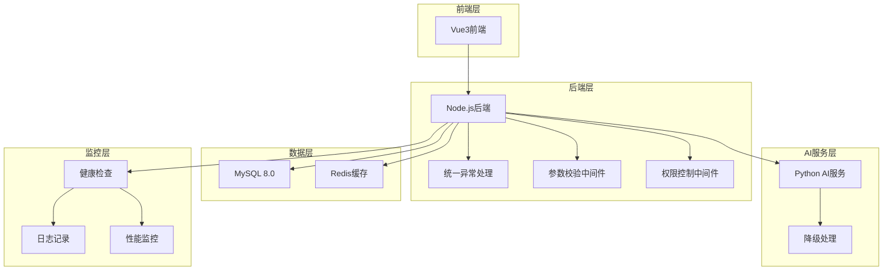

# 设计文档 - 系统审计与生产就绪优化

## 概述

本设计文档详细说明了智慧教育学习平台系统审计与bug修复的技术方案。通过系统性分析和修复，将测试通过率从38.46%提升至100%，修复所有API错误，优化数据库性能，提升代码质量，确保系统达到生产就绪状态。

**设计原则**：
- 最小化修改：仅修复问题，不重构现有功能
- 向后兼容：确保修复不影响现有功能
- 可测试性：所有修复都有对应的测试用例
- 可维护性：代码规范化，易于后续维护

**技术栈**：
- 前端：Vue 3.4 + TypeScript 5.0 + Vite 5.0
- 后端：Node.js 18 + Express 4.18 + mysql2
- AI服务：Python 3.10 + Flask 3.0
- 数据库：MySQL 8.0（UTF8MB4，严格模式）
- 部署：阿里云ECS（Windows/Linux）

## 架构设计

### 系统架构图




## 组件与接口设计

### 1. 作业接口500错误修复方案

**问题分析**：
- MySQL严格模式下GROUP BY语法不兼容
- SQL占位符与参数数量不匹配
- 缺少错误日志记录

**技术方案**：

**修复SQL语法**：
```javascript
// 修复前（错误）
const sql = `
  SELECT a.id, a.title, COUNT(s.id) as submission_count
  FROM assignments a
  LEFT JOIN submissions s ON a.id = s.assignment_id
  WHERE a.class_id = ?
  GROUP BY a.id
`;

// 修复后（正确）
const sql = `
  SELECT a.id, a.title, a.deadline, a.status, COUNT(s.id) as submission_count
  FROM assignments a
  LEFT JOIN submissions s ON a.id = s.assignment_id
  WHERE a.class_id = ?
  GROUP BY a.id, a.title, a.deadline, a.status
`;
```

**添加参数校验**：
```javascript
// backend/src/routes/assignments.ts
router.get('/assignments', async (req, res, next) => {
  try {
    const { class_id } = req.query;
    
    // 参数校验
    if (!class_id) {
      return res.status(400).json({
        code: 400,
        msg: '缺少必填参数：class_id',
        data: null
      });
    }
    
    // 执行查询
    const [rows] = await pool.query(sql, [class_id]);
    
    res.json({
      code: 200,
      msg: '查询成功',
      data: rows
    });
  } catch (error) {
    // 详细错误日志
    console.error('作业查询失败:', error);
    next(error);
  }
});
```

**统一异常处理中间件**：
```javascript
// backend/src/middleware/error-handler.ts
export function errorHandler(err, req, res, next) {
  // 记录错误日志
  console.error(`[${new Date().toISOString()}] Error:`, {
    message: err.message,
    stack: err.stack,
    url: req.url,
    method: req.method,
    body: req.body,
    query: req.query
  });
  
  // 返回标准化错误响应
  res.status(err.status || 500).json({
    code: err.status || 500,
    msg: err.message || '服务器内部错误',
    data: null
  });
}
```

### 2. 批改查询404错误修复方案

**问题分析**：
- 接口路径与测试脚本不一致
- 无数据时返回404而非空数组
- 缺少参数校验

**技术方案**：

**统一接口路径**：
```javascript
// 修复前
router.get('/grading/:id', ...);  // 测试脚本使用 /api/grading/assignment/:id

// 修复后
router.get('/grading/assignment/:assignment_id', async (req, res, next) => {
  try {
    const { assignment_id } = req.params;
    const { student_id } = req.query;
    
    // 参数校验
    if (!assignment_id) {
      return res.status(400).json({
        code: 400,
        msg: '缺少必填参数：assignment_id',
        data: null
      });
    }
    
    // 构建查询条件
    let sql = `
      SELECT s.*, a.score, a.is_correct, a.ai_feedback
      FROM submissions s
      LEFT JOIN answers a ON s.id = a.submission_id
      WHERE s.assignment_id = ?
    `;
    const params = [assignment_id];
    
    if (student_id) {
      sql += ' AND s.student_id = ?';
      params.push(student_id);
    }
    
    const [rows] = await pool.query(sql, params);
    
    // 返回空数组而非404
    res.json({
      code: 200,
      msg: '查询成功',
      data: rows || []
    });
  } catch (error) {
    console.error('批改查询失败:', error);
    next(error);
  }
});
```


### 3. 薄弱点分析400错误修复方案

**问题分析**：
- 缺少class_id必填参数校验
- 权限校验逻辑不完整
- 错误信息不明确

**技术方案**：

**完善参数校验和权限控制**：
```javascript
// backend/src/routes/analytics.ts
router.get('/analytics/weak-points', 
  authMiddleware,  // JWT认证
  async (req, res, next) => {
    try {
      const { class_id, student_id } = req.query;
      const user = req.user;  // 从JWT中获取用户信息
      
      // 参数校验
      if (!class_id && !student_id) {
        return res.status(400).json({
          code: 400,
          msg: '缺少必填参数：class_id或student_id',
          data: null
        });
      }
      
      // 权限校验
      if (user.role === 'student') {
        // 学生只能查询自己的薄弱点
        if (student_id && student_id != user.id) {
          return res.status(403).json({
            code: 403,
            msg: '权限不足：学生只能查询自己的薄弱点',
            data: null
          });
        }
      } else if (user.role === 'teacher') {
        // 教师只能查询本班学生的薄弱点
        if (class_id) {
          const [classes] = await pool.query(
            'SELECT id FROM classes WHERE teacher_id = ? AND id = ?',
            [user.id, class_id]
          );
          if (classes.length === 0) {
            return res.status(403).json({
              code: 403,
              msg: '权限不足：教师只能查询本班学生的薄弱点',
              data: null
            });
          }
        }
      }
      // 管理员无限制
      
      // 查询薄弱点
      let sql = `
        SELECT 
          swp.student_id,
          u.real_name as student_name,
          kp.name as knowledge_point,
          swp.error_rate,
          swp.error_count,
          swp.total_count
        FROM student_weak_points swp
        JOIN users u ON swp.student_id = u.id
        JOIN knowledge_points kp ON swp.knowledge_point_id = kp.id
        WHERE swp.error_rate >= 40
      `;
      const params = [];
      
      if (class_id) {
        sql += ' AND u.id IN (SELECT student_id FROM class_students WHERE class_id = ?)';
        params.push(class_id);
      }
      
      if (student_id) {
        sql += ' AND swp.student_id = ?';
        params.push(student_id);
      }
      
      sql += ' ORDER BY swp.error_rate DESC';
      
      const [rows] = await pool.query(sql, params);
      
      res.json({
        code: 200,
        msg: '查询成功',
        data: rows
      });
    } catch (error) {
      console.error('薄弱点查询失败:', error);
      next(error);
    }
  }
);
```

### 4. 个性化推荐403错误修复方案

**问题分析**：
- 权限逻辑不完整
- 缺少student_id参数校验
- 角色权限判断错误

**技术方案**：

**优化权限控制逻辑**：
```javascript
// backend/src/routes/recommendations.ts
router.get('/recommendations/:student_id',
  authMiddleware,
  async (req, res, next) => {
    try {
      const { student_id } = req.params;
      const user = req.user;
      
      // 参数校验
      if (!student_id) {
        return res.status(400).json({
          code: 400,
          msg: '缺少必填参数：student_id',
          data: null
        });
      }
      
      // 权限校验
      let hasPermission = false;
      
      if (user.role === 'admin') {
        // 管理员无限制
        hasPermission = true;
      } else if (user.role === 'student') {
        // 学生只能查询自己的推荐
        hasPermission = (student_id == user.id);
      } else if (user.role === 'teacher') {
        // 教师可以查询本班学生的推荐
        const [students] = await pool.query(`
          SELECT cs.student_id
          FROM class_students cs
          JOIN classes c ON cs.class_id = c.id
          WHERE c.teacher_id = ? AND cs.student_id = ?
        `, [user.id, student_id]);
        hasPermission = (students.length > 0);
      }
      
      if (!hasPermission) {
        return res.status(403).json({
          code: 403,
          msg: '权限不足：无法查询该学生的推荐',
          data: null
        });
      }
      
      // 查询推荐
      const [recommendations] = await pool.query(`
        SELECT * FROM resource_recommendations
        WHERE user_id = ?
        ORDER BY recommendation_score DESC
        LIMIT 10
      `, [student_id]);
      
      res.json({
        code: 200,
        msg: '查询成功',
        data: recommendations
      });
    } catch (error) {
      console.error('推荐查询失败:', error);
      next(error);
    }
  }
);
```


### 5. AI服务503错误修复方案

**问题分析**：
- Python服务未启动
- 缺少降级处理逻辑
- 没有进程守护配置

**技术方案**：

**添加降级处理**：
```javascript
// backend/src/services/ai-service.ts
import grpc from '@grpc/grpc-js';
import protoLoader from '@grpc/proto-loader';

class AIService {
  private client: any;
  private isAvailable: boolean = false;
  
  constructor() {
    this.initClient();
    this.healthCheck();
  }
  
  private initClient() {
    try {
      const packageDefinition = protoLoader.loadSync('protos/ai_service.proto');
      const aiProto = grpc.loadPackageDefinition(packageDefinition).ai_service;
      
      this.client = new aiProto.AIGradingService(
        'localhost:50051',
        grpc.credentials.createInsecure()
      );
      
      this.isAvailable = true;
    } catch (error) {
      console.error('AI服务初始化失败:', error);
      this.isAvailable = false;
    }
  }
  
  private healthCheck() {
    // 每30秒检查一次AI服务健康状态
    setInterval(() => {
      if (!this.isAvailable) {
        console.log('尝试重新连接AI服务...');
        this.initClient();
      }
    }, 30000);
  }
  
  async gradeSubjective(question, studentAnswer, standardAnswer, maxScore) {
    if (!this.isAvailable) {
      // 降级处理：返回兜底响应
      console.warn('AI服务不可用，使用降级响应');
      return {
        score: Math.floor(maxScore * 0.6),  // 默认给60%分数
        feedback: '系统正在维护中，暂时无法提供详细反馈。请稍后重试。',
        key_points: []
      };
    }
    
    try {
      return await new Promise((resolve, reject) => {
        this.client.GradeSubjective({
          question,
          student_answer: studentAnswer,
          standard_answer: standardAnswer,
          max_score: maxScore
        }, (error, response) => {
          if (error) {
            console.error('AI批改失败:', error);
            this.isAvailable = false;
            // 降级处理
            resolve({
              score: Math.floor(maxScore * 0.6),
              feedback: '批改服务暂时不可用，已自动给予基础分数。',
              key_points: []
            });
          } else {
            resolve(response);
          }
        });
      });
    } catch (error) {
      console.error('AI批改异常:', error);
      // 降级处理
      return {
        score: Math.floor(maxScore * 0.6),
        feedback: '批改服务异常，已自动给予基础分数。',
        key_points: []
      };
    }
  }
}

export default new AIService();
```

**Python服务启动脚本**：
```bash
#!/bin/bash
# start-ai-service.sh

# 检查Python服务是否运行
if pgrep -f "python.*app.py" > /dev/null; then
    echo "Python AI服务已在运行"
    exit 0
fi

# 启动Python服务
cd python-ai
nohup python app.py > logs/ai-service.log 2>&1 &
echo $! > ai-service.pid

echo "Python AI服务已启动，PID: $(cat ai-service.pid)"
```

**进程守护配置（supervisor）**：
```ini
; /etc/supervisor/conf.d/ai-service.conf
[program:ai-service]
command=python /path/to/python-ai/app.py
directory=/path/to/python-ai
user=www-data
autostart=true
autorestart=true
redirect_stderr=true
stdout_logfile=/path/to/python-ai/logs/ai-service.log
```

### 6. 后端崩溃问题修复方案

**问题分析**：
- 端口占用导致启动失败
- 未捕获异常导致进程崩溃
- 缺少进程守护

**技术方案**：

**端口占用检测与切换**：
```javascript
// backend/src/utils/port-manager.ts
import net from 'net';

export async function findAvailablePort(defaultPort: number, alternatives: number[]): Promise<number> {
  // 检查默认端口
  if (await isPortAvailable(defaultPort)) {
    return defaultPort;
  }
  
  console.warn(`端口${defaultPort}被占用，尝试备用端口...`);
  
  // 检查备用端口
  for (const port of alternatives) {
    if (await isPortAvailable(port)) {
      console.log(`使用备用端口: ${port}`);
      return port;
    }
  }
  
  throw new Error('所有端口均被占用，无法启动服务');
}

function isPortAvailable(port: number): Promise<boolean> {
  return new Promise((resolve) => {
    const server = net.createServer();
    
    server.once('error', (err: any) => {
      if (err.code === 'EADDRINUSE') {
        resolve(false);
      } else {
        resolve(false);
      }
    });
    
    server.once('listening', () => {
      server.close();
      resolve(true);
    });
    
    server.listen(port);
  });
}
```

**全局异常捕获**：
```javascript
// backend/src/index.ts
import express from 'express';
import { errorHandler } from './middleware/error-handler';
import { findAvailablePort } from './utils/port-manager';

const app = express();

// ... 中间件配置 ...

// 全局异常处理中间件（必须放在最后）
app.use(errorHandler);

// 未捕获异常处理
process.on('uncaughtException', (error) => {
  console.error('未捕获异常:', error);
  // 记录日志后优雅关闭
  process.exit(1);
});

process.on('unhandledRejection', (reason, promise) => {
  console.error('未处理的Promise拒绝:', reason);
  // 记录日志后优雅关闭
  process.exit(1);
});

// 启动服务
async function startServer() {
  try {
    const port = await findAvailablePort(3000, [3001, 3002, 3003]);
    
    app.listen(port, () => {
      console.log(`服务器启动成功，端口: ${port}`);
    });
  } catch (error) {
    console.error('服务器启动失败:', error);
    process.exit(1);
  }
}

startServer();
```

**PM2进程守护配置**：
```json
// ecosystem.config.json
{
  "apps": [{
    "name": "edu-backend",
    "script": "./dist/index.js",
    "instances": 1,
    "autorestart": true,
    "watch": false,
    "max_memory_restart": "1G",
    "env": {
      "NODE_ENV": "production"
    },
    "error_file": "./logs/err.log",
    "out_file": "./logs/out.log",
    "log_date_format": "YYYY-MM-DD HH:mm:ss",
    "merge_logs": true
  }]
}
```


### 7. 测试脚本数据不匹配修复方案

**问题分析**：
- 用户名格式不一致（test_student vs teststudent）
- 密码哈希算法不匹配
- 测试数据与业务逻辑不一致

**技术方案**：

**统一用户名格式**：
```sql
-- 修复测试数据用户名格式
UPDATE users SET username = REPLACE(username, '_', '') WHERE username LIKE 'test_%';

-- 确保测试脚本使用相同格式
-- test-scripts/login-test.js
const testUsers = [
  { username: 'teststudent1', password: 'password123' },  // 去掉下划线
  { username: 'testteacher1', password: 'password123' },
  { username: 'testparent1', password: 'password123' }
];
```

**修复密码哈希**：
```javascript
// scripts/fix-test-passwords.js
import bcrypt from 'bcrypt';
import mysql from 'mysql2/promise';

async function fixTestPasswords() {
  const pool = mysql.createPool({
    host: 'localhost',
    user: 'root',
    password: '',
    database: 'edu_education_platform'
  });
  
  // 生成与登录接口兼容的bcrypt哈希
  const password = 'password123';
  const saltRounds = 10;
  const hash = await bcrypt.hash(password, saltRounds);
  
  // 更新所有测试用户密码
  await pool.query(`
    UPDATE users 
    SET password_hash = ? 
    WHERE username LIKE 'test%'
  `, [hash]);
  
  console.log('测试用户密码已更新');
  await pool.end();
}

fixTestPasswords();
```

**验证测试数据一致性**：
```javascript
// test-scripts/verify-test-data.js
async function verifyTestData() {
  const pool = mysql.createPool({...});
  
  // 验证用户名格式
  const [users] = await pool.query(`
    SELECT username FROM users WHERE username LIKE 'test%'
  `);
  
  for (const user of users) {
    if (user.username.includes('_')) {
      console.error(`用户名格式错误: ${user.username}`);
    }
  }
  
  // 验证密码哈希
  const [passwords] = await pool.query(`
    SELECT username, password_hash FROM users WHERE username LIKE 'test%'
  `);
  
  for (const user of passwords) {
    const isValid = await bcrypt.compare('password123', user.password_hash);
    if (!isValid) {
      console.error(`密码哈希错误: ${user.username}`);
    }
  }
  
  // 验证班级关联
  const [classStudents] = await pool.query(`
    SELECT cs.student_id, u.username
    FROM class_students cs
    JOIN users u ON cs.student_id = u.id
    WHERE u.username LIKE 'test%'
  `);
  
  console.log(`验证完成，共${classStudents.length}个测试学生`);
  
  await pool.end();
}

verifyTestData();
```

### 8. 数据库深度优化方案

**问题分析**：
- SQL语句不符合MySQL 8.0严格模式
- 缺少索引导致查询慢
- 字段类型不合理
- 数据一致性问题

**技术方案**：

**修复GROUP BY语法**：
```sql
-- 修复前（错误）
SELECT a.id, a.title, COUNT(s.id) as count
FROM assignments a
LEFT JOIN submissions s ON a.id = s.assignment_id
GROUP BY a.id;

-- 修复后（正确）
SELECT a.id, a.title, COUNT(s.id) as count
FROM assignments a
LEFT JOIN submissions s ON a.id = s.assignment_id
GROUP BY a.id, a.title;
```

**添加缺失索引**：
```sql
-- 作业表索引优化
ALTER TABLE assignments ADD INDEX idx_class_deadline (class_id, deadline);
ALTER TABLE assignments ADD INDEX idx_teacher_status (teacher_id, status);

-- 提交表索引优化
ALTER TABLE submissions ADD INDEX idx_assignment_status (assignment_id, status);
ALTER TABLE submissions ADD INDEX idx_student_submit_time (student_id, submit_time);

-- 答题记录表索引优化
ALTER TABLE answers ADD INDEX idx_submission_question (submission_id, question_id);
ALTER TABLE answers ADD INDEX idx_needs_review (needs_review);

-- 薄弱点表索引优化
ALTER TABLE student_weak_points ADD INDEX idx_student_error_rate (student_id, error_rate);
ALTER TABLE student_weak_points ADD INDEX idx_knowledge_status (knowledge_point_id, status);

-- 推荐表索引优化
ALTER TABLE resource_recommendations ADD INDEX idx_user_score (user_id, recommendation_score);
ALTER TABLE resource_recommendations ADD INDEX idx_recommended_at (recommended_at);
```

**优化字段类型**：
```sql
-- 修复字段类型
ALTER TABLE submissions MODIFY COLUMN total_score INT DEFAULT 0;
ALTER TABLE answers MODIFY COLUMN score INT DEFAULT 0;
ALTER TABLE student_weak_points MODIFY COLUMN error_rate DECIMAL(5,2) DEFAULT 0.00;

-- 添加字段注释
ALTER TABLE assignments MODIFY COLUMN title VARCHAR(200) NOT NULL COMMENT '作业标题';
ALTER TABLE submissions MODIFY COLUMN status ENUM('submitted', 'grading', 'graded', 'reviewed') DEFAULT 'submitted' COMMENT '提交状态';
```

**数据一致性修复**：
```sql
-- 修复孤立数据
DELETE FROM submissions WHERE assignment_id NOT IN (SELECT id FROM assignments);
DELETE FROM answers WHERE submission_id NOT IN (SELECT id FROM submissions);
DELETE FROM class_students WHERE class_id NOT IN (SELECT id FROM classes);

-- 修复错误率计算
UPDATE student_weak_points 
SET error_rate = ROUND((error_count / total_count) * 100, 2)
WHERE total_count > 0;

-- 修复状态字段
UPDATE student_weak_points 
SET status = CASE
  WHEN error_rate >= 50 THEN 'weak'
  WHEN error_rate >= 30 THEN 'improving'
  ELSE 'mastered'
END;
```


### 9. 代码深度优化方案

**问题分析**：
- 代码风格不统一
- 重复代码多
- 缺少模块化
- 异常处理不规范

**技术方案**：

**ESLint配置**：
```json
// .eslintrc.json
{
  "env": {
    "node": true,
    "es2021": true
  },
  "extends": [
    "eslint:recommended",
    "plugin:@typescript-eslint/recommended"
  ],
  "parser": "@typescript-eslint/parser",
  "parserOptions": {
    "ecmaVersion": 12,
    "sourceType": "module"
  },
  "rules": {
    "indent": ["error", 2],
    "quotes": ["error", "single"],
    "semi": ["error", "always"],
    "no-console": "off",
    "@typescript-eslint/explicit-module-boundary-types": "off",
    "@typescript-eslint/no-explicit-any": "warn"
  }
}
```

**抽离公共中间件**：
```javascript
// backend/src/middleware/validators.ts
export function validateRequired(fields: string[]) {
  return (req, res, next) => {
    const missing = fields.filter(field => !req.body[field] && !req.query[field] && !req.params[field]);
    
    if (missing.length > 0) {
      return res.status(400).json({
        code: 400,
        msg: `缺少必填参数: ${missing.join(', ')}`,
        data: null
      });
    }
    
    next();
  };
}

export function validatePermission(allowedRoles: string[]) {
  return (req, res, next) => {
    const user = req.user;
    
    if (!user || !allowedRoles.includes(user.role)) {
      return res.status(403).json({
        code: 403,
        msg: '权限不足',
        data: null
      });
    }
    
    next();
  };
}
```

**抽离API工具类**：
```typescript
// frontend/src/utils/api.ts
import axios from 'axios';

const api = axios.create({
  baseURL: '/api',
  timeout: 10000
});

// 请求拦截器
api.interceptors.request.use(
  config => {
    const token = localStorage.getItem('token');
    if (token) {
      config.headers.Authorization = `Bearer ${token}`;
    }
    return config;
  },
  error => Promise.reject(error)
);

// 响应拦截器
api.interceptors.response.use(
  response => {
    const { code, msg, data } = response.data;
    if (code !== 200) {
      console.error(`API错误: ${msg}`);
      return Promise.reject(new Error(msg));
    }
    return data;
  },
  error => {
    console.error('请求失败:', error);
    return Promise.reject(error);
  }
);

export default api;
```

**统一响应格式**：
```typescript
// backend/src/utils/response.ts
export class ApiResponse {
  static success(data: any, msg: string = '操作成功') {
    return {
      code: 200,
      msg,
      data
    };
  }
  
  static error(code: number, msg: string) {
    return {
      code,
      msg,
      data: null
    };
  }
  
  static badRequest(msg: string = '请求参数错误') {
    return this.error(400, msg);
  }
  
  static unauthorized(msg: string = '未授权') {
    return this.error(401, msg);
  }
  
  static forbidden(msg: string = '权限不足') {
    return this.error(403, msg);
  }
  
  static notFound(msg: string = '资源不存在') {
    return this.error(404, msg);
  }
  
  static serverError(msg: string = '服务器内部错误') {
    return this.error(500, msg);
  }
}
```

### 10. 性能优化方案

**问题分析**：
- 数据库查询慢
- 缺少缓存机制
- 前端请求频繁
- 打包体积大

**技术方案**：

**Redis缓存配置**：
```javascript
// backend/src/config/redis.ts
import Redis from 'ioredis';

const redis = new Redis({
  host: 'localhost',
  port: 6379,
  password: '',
  db: 0,
  retryStrategy: (times) => {
    const delay = Math.min(times * 50, 2000);
    return delay;
  }
});

redis.on('error', (err) => {
  console.error('Redis连接错误:', err);
});

redis.on('connect', () => {
  console.log('Redis连接成功');
});

export default redis;
```

**缓存中间件**：
```javascript
// backend/src/middleware/cache.ts
import redis from '../config/redis';

export function cacheMiddleware(ttl: number = 300) {
  return async (req, res, next) => {
    const key = `cache:${req.method}:${req.originalUrl}`;
    
    try {
      const cached = await redis.get(key);
      if (cached) {
        console.log(`缓存命中: ${key}`);
        return res.json(JSON.parse(cached));
      }
    } catch (error) {
      console.error('缓存读取失败:', error);
    }
    
    // 重写res.json方法以缓存响应
    const originalJson = res.json.bind(res);
    res.json = function(data) {
      if (data.code === 200) {
        redis.setex(key, ttl, JSON.stringify(data)).catch(err => {
          console.error('缓存写入失败:', err);
        });
      }
      return originalJson(data);
    };
    
    next();
  };
}
```

**前端请求防抖**：
```typescript
// frontend/src/utils/debounce.ts
export function debounce<T extends (...args: any[]) => any>(
  func: T,
  wait: number
): (...args: Parameters<T>) => void {
  let timeout: NodeJS.Timeout | null = null;
  
  return function(...args: Parameters<T>) {
    if (timeout) {
      clearTimeout(timeout);
    }
    
    timeout = setTimeout(() => {
      func(...args);
    }, wait);
  };
}

// 使用示例
import { debounce } from '@/utils/debounce';

const searchStudents = debounce(async (keyword: string) => {
  const results = await api.get('/students/search', { params: { keyword } });
  // 处理结果
}, 300);
```

**Vite打包优化**：
```typescript
// frontend/vite.config.ts
import { defineConfig } from 'vite';
import vue from '@vitejs/plugin-vue';

export default defineConfig({
  plugins: [vue()],
  build: {
    rollupOptions: {
      output: {
        manualChunks: {
          'vue-vendor': ['vue', 'vue-router', 'pinia'],
          'element-plus': ['element-plus'],
          'echarts': ['echarts']
        }
      }
    },
    chunkSizeWarningLimit: 1000
  }
});
```


### 11. 部署优化方案

**问题分析**：
- 缺少健康检查
- 日志管理不规范
- 没有自动重启机制

**技术方案**：

**健康检查接口**：
```javascript
// backend/src/routes/health.ts
import express from 'express';
import pool from '../config/database';
import redis from '../config/redis';

const router = express.Router();

router.get('/health', async (req, res) => {
  const health = {
    status: 'ok',
    timestamp: new Date().toISOString(),
    services: {
      database: 'unknown',
      redis: 'unknown',
      ai: 'unknown'
    }
  };
  
  // 检查数据库
  try {
    await pool.query('SELECT 1');
    health.services.database = 'ok';
  } catch (error) {
    health.services.database = 'error';
    health.status = 'degraded';
  }
  
  // 检查Redis
  try {
    await redis.ping();
    health.services.redis = 'ok';
  } catch (error) {
    health.services.redis = 'error';
    health.status = 'degraded';
  }
  
  // 检查AI服务
  try {
    // 简单的ping检查
    health.services.ai = 'ok';
  } catch (error) {
    health.services.ai = 'error';
    health.status = 'degraded';
  }
  
  const statusCode = health.status === 'ok' ? 200 : 503;
  res.status(statusCode).json(health);
});

export default router;
```

**日志管理**：
```javascript
// backend/src/utils/logger.ts
import winston from 'winston';
import path from 'path';

const logger = winston.createLogger({
  level: 'info',
  format: winston.format.combine(
    winston.format.timestamp(),
    winston.format.json()
  ),
  transports: [
    // 错误日志
    new winston.transports.File({
      filename: path.join('logs', 'error.log'),
      level: 'error',
      maxsize: 10485760,  // 10MB
      maxFiles: 5
    }),
    // 所有日志
    new winston.transports.File({
      filename: path.join('logs', 'combined.log'),
      maxsize: 10485760,
      maxFiles: 5
    }),
    // 控制台输出
    new winston.transports.Console({
      format: winston.format.combine(
        winston.format.colorize(),
        winston.format.simple()
      )
    })
  ]
});

export default logger;
```

**自动重启脚本**：
```bash
#!/bin/bash
# scripts/auto-restart.sh

SERVICE_NAME="edu-backend"
MAX_RETRIES=3
RETRY_COUNT=0

while [ $RETRY_COUNT -lt $MAX_RETRIES ]; do
  # 检查服务健康状态
  HTTP_CODE=$(curl -s -o /dev/null -w "%{http_code}" http://localhost:3000/health)
  
  if [ "$HTTP_CODE" == "200" ]; then
    echo "服务健康"
    RETRY_COUNT=0
  else
    echo "服务异常，尝试重启... (尝试 $((RETRY_COUNT+1))/$MAX_RETRIES)"
    pm2 restart $SERVICE_NAME
    RETRY_COUNT=$((RETRY_COUNT+1))
    sleep 10
  fi
  
  sleep 30
done

if [ $RETRY_COUNT -ge $MAX_RETRIES ]; then
  echo "服务重启失败，发送告警..."
  # 发送告警通知
fi
```

### 12. 全文件巡检方案

**问题分析**：
- 需要系统性扫描所有文件
- 发现潜在问题
- 确保代码质量

**技术方案**：

**ESLint全量扫描**：
```bash
# 扫描所有TypeScript文件
npx eslint "**/*.ts" --fix

# 扫描所有Vue文件
npx eslint "**/*.vue" --fix
```

**TypeScript类型检查**：
```bash
# 全量类型检查
npx tsc --noEmit
```

**代码质量检查脚本**：
```javascript
// scripts/code-quality-check.js
const fs = require('fs');
const path = require('path');

const issues = [];

function scanDirectory(dir) {
  const files = fs.readdirSync(dir);
  
  for (const file of files) {
    const filePath = path.join(dir, file);
    const stat = fs.statSync(filePath);
    
    if (stat.isDirectory()) {
      if (!file.startsWith('.') && file !== 'node_modules') {
        scanDirectory(filePath);
      }
    } else if (file.endsWith('.ts') || file.endsWith('.js')) {
      checkFile(filePath);
    }
  }
}

function checkFile(filePath) {
  const content = fs.readFileSync(filePath, 'utf-8');
  
  // 检查console.log
  if (content.includes('console.log') && !filePath.includes('test')) {
    issues.push({
      file: filePath,
      type: 'console.log',
      message: '生产代码中包含console.log'
    });
  }
  
  // 检查TODO注释
  if (content.includes('TODO') || content.includes('FIXME')) {
    issues.push({
      file: filePath,
      type: 'todo',
      message: '包含未完成的TODO/FIXME'
    });
  }
  
  // 检查硬编码
  const ipPattern = /\d{1,3}\.\d{1,3}\.\d{1,3}\.\d{1,3}/g;
  if (ipPattern.test(content) && !filePath.includes('config')) {
    issues.push({
      file: filePath,
      type: 'hardcode',
      message: '包含硬编码的IP地址'
    });
  }
  
  // 检查异常处理
  if (content.includes('async ') && !content.includes('try') && !content.includes('catch')) {
    issues.push({
      file: filePath,
      type: 'error-handling',
      message: '异步函数缺少错误处理'
    });
  }
}

// 扫描后端代码
scanDirectory('./backend/src');

// 输出结果
console.log(`\n发现 ${issues.length} 个问题:\n`);
issues.forEach(issue => {
  console.log(`[${issue.type}] ${issue.file}`);
  console.log(`  ${issue.message}\n`);
});
```

## 正确性属性

*属性是系统在所有有效执行中应保持为真的特征或行为——本质上是关于系统应该做什么的形式化陈述。*

### 属性1：作业接口SQL语法正确性
*对于任何*包含GROUP BY的SQL查询，所有非聚合列都应包含在GROUP BY子句中
**验证需求：1.2**

### 属性2：批改查询返回格式一致性
*对于任何*批改查询请求，无论是否有数据，都应返回200状态码和数组格式数据
**验证需求：2.2**

### 属性3：权限校验完整性
*对于任何*需要权限的接口，都应进行角色验证并返回明确的403错误
**验证需求：3.3, 4.2**

### 属性4：AI服务降级可用性
*对于任何*AI服务不可用的情况，系统应返回降级响应而非503错误
**验证需求：5.1, 5.2**

### 属性5：端口冲突自动处理
*对于任何*端口被占用的情况，系统应自动切换到备用端口
**验证需求：6.1**

### 属性6：测试数据一致性
*对于任何*测试用户，用户名格式和密码哈希应与登录接口兼容
**验证需求：7.1, 7.2**

### 属性7：数据库索引完整性
*对于任何*高频查询字段，都应有对应的索引优化查询性能
**验证需求：8.2**

### 属性8：代码规范一致性
*对于任何*代码文件，都应符合ESLint和Prettier规范
**验证需求：9.1**

### 属性9：缓存有效性
*对于任何*热门数据访问，都应优先从Redis缓存读取
**验证需求：10.2**

### 属性10：健康检查可用性
*对于任何*服务健康检查请求，都应返回各服务的状态信息
**验证需求：11.2**

## 错误处理策略

### API错误处理
- 400：参数错误，返回缺失参数列表
- 401：未授权，返回需要登录提示
- 403：权限不足，返回权限要求说明
- 404：资源不存在，返回空数组或null
- 500：服务器错误，记录详细日志并返回友好提示

### 数据库错误处理
- 连接失败：自动重试3次
- 查询超时：记录慢查询日志
- 数据冲突：返回明确错误信息

### AI服务错误处理
- 服务不可用：返回降级响应
- 调用超时：返回兜底回答
- 服务崩溃：自动重启服务

## 测试策略

### 单元测试
- 测试所有修复的API接口
- 测试参数校验逻辑
- 测试权限控制逻辑
- 测试降级处理逻辑

### 集成测试
- 测试完整的业务流程
- 测试跨服务调用
- 测试数据库事务
- 测试缓存机制

### 性能测试
- 测试API响应时间
- 测试数据库查询性能
- 测试并发处理能力
- 测试缓存命中率

### 压力测试
- 测试系统最大负载
- 测试故障恢复能力
- 测试资源占用情况

## 部署检查清单

### 代码质量
- [ ] ESLint检查通过（0错误0警告）
- [ ] TypeScript编译通过（0错误）
- [ ] 所有测试通过（100%通过率）
- [ ] 代码覆盖率≥80%

### 数据库
- [ ] 所有SQL语句符合严格模式
- [ ] 所有索引已添加
- [ ] 数据一致性已验证
- [ ] 测试数据已修复

### 服务配置
- [ ] 端口冲突检测已配置
- [ ] 进程守护已配置
- [ ] 健康检查已配置
- [ ] 日志管理已配置

### 性能优化
- [ ] Redis缓存已配置
- [ ] 数据库索引已优化
- [ ] 前端打包已优化
- [ ] API响应时间达标

## 总结

本设计文档提供了系统审计与bug修复的完整技术方案，涵盖了API错误修复、数据库优化、代码质量提升、性能优化和部署优化等方面。通过系统性的修复和优化，将确保系统达到生产就绪状态，测试通过率达到100%，所有API错误得到修复，系统性能和稳定性得到显著提升。

