# 毕业设计开题报告

---

## 课题名称

**基于多语言协同架构的 AI 驱动智慧教育学习平台设计与实现**

---

## 一、选题背景与意义

### 1.1 选题背景

随着人工智能、大数据等新一代信息技术的迅猛发展，教育信息化已经从单纯的"课件上网""录播课堂"阶段迈入智能化、个性化的新阶段。教育部《教育信息化 2.0 行动计划》明确提出，要"以人工智能、大数据等新技术为依托，推进教育教学模式变革"，强调要利用智能技术支撑个性化的学习路径生成、智能化的学习评价和精细化的学习管理。

然而，当前主流在线教育平台（如学习通、超星、慕课网等）在实际应用中仍存在以下痛点：

1. **教师批改负担重**：客观题可机器判分，但主观题、编程题仍依赖人工批改，反馈周期长、效率低；
2. **学生反馈不及时**：作业批改延迟、错题分析粗放，难以形成有效的"学—练—评—纠"闭环；
3. **家长难以掌握学情**：缺少可视化的学情监控渠道，家校沟通断层；
4. **学习路径僵化**：所有学生使用同一套学习路径，无法依据掌握度动态调整；
5. **刷课行为频发**：缺乏有效的人脸身份核验机制，代看、代学、代考现象严重，影响学习质量评价的真实性。

在此背景下，本项目尝试综合运用 **Vue 3 前端、Node.js 后端、Python AI 服务、Rust 高性能服务** 构建一个面向"学生—教师—家长"三角色闭环的 AI 驱动智慧教育学习平台，重点突破智能批改、动态学习路径、防刷课核验等关键技术。本项目先后参加**传智杯国赛**与**中国大学生计算机设计大赛**，并在中国大学生计算机设计大赛省赛中荣获**三等奖**，相关成果已得到赛事专家的初步认可。

### 1.2 选题意义

#### （1）理论意义

- 探索 **多语言微服务协同架构** 在教育场景下的落地方式，验证 Node.js + Python + Rust 通过 gRPC 跨语言通信的可行性与性能；
- 探索 **BERT 主观题自动评分模型** 在教育领域的应用，研究评分准确率提升方法；
- 研究 **基于余弦相似度的静默人脸核验算法**，为防刷课场景提供新的技术路径。

#### （2）实践意义

- **减负**：AI 自动批改可将教师主观题批改工作量降低 80% 以上；
- **增效**：学生答题后即时获得反馈，"学—练—评"闭环时长从天级缩短至秒级；
- **沟通**：家长端实时查看孩子学习路径、视频进度、错题本与薄弱点，实现家校协同；
- **公平**：FaceGuard 防刷课系统可显著提升学习质量评价的真实性；
- **个性化**：AI 动态学习路径能基于掌握度自动跳过已掌握内容、强化薄弱点，提升学习效率。

---

## 二、国内外研究现状

### 2.1 智能教育平台现状

- **国外**：Coursera、edX、Khan Academy 等平台在自适应学习、智能推荐方向已有成熟实践，但缺少面向中国 K12/职业教育的本地化适配；
- **国内**：学习通、超星、智慧树等平台以录播课+测验为主，AI 元素集中在题目推荐和简单行为分析，缺少深度学习路径动态调整、防刷课核验等能力。

### 2.2 关键技术现状

| 关键技术 | 国内外现状 | 本项目创新点 |
|---------|----------|------------|
| 主观题自动评分 | 基于 LSTM/BERT 的模型已在英语作文评分上有应用，但中文主观题评分成熟度低 | 针对教育领域优化 BERT 模型，准确率≥92% |
| 学习路径生成 | 多采用规则推荐或简单协同过滤 | 结合知识点掌握度评估、动态调整 |
| 防刷课 | 多采用一次性签到或人脸登录 | 每 2 分钟静默余弦相似度核验 + 活体检测 |
| 跨语言微服务 | 主流为 Java/Go 单语言 | Node.js + Python + Rust 多语言 gRPC 协同 |
| 客观题批改 | 服务端 Python/Java 批改 | Rust-WASM 前端批改，速度提升 8 倍 |
| 人脸特征加密 | 多直接采用 AES 等国际标准，缺少面向移动端低算力场景的国产自研轻量分组密码 | 自研 FEN-SAFE v1.1 轻量分组密码（LIGHT 5 轮 + SECURE 7 轮），与 AES-128 对照测试，S 盒非线性度 112 达 AES 同级、NIST SP800-22 随机性 11/11 全 PASS、LIGHT 2μs/分组快于 AES 软件基准 |
| 视频智能上下架 | 多依赖人工判断或简单完成率统计 | 完成率守门 + 7 天保护期 + 教师锁定 + 难点放宽 + 审计日志 |

---

## 三、研究内容与目标

### 3.1 研究内容

1. **多语言协同架构设计**：研究 Node.js、Python、Rust 三种语言通过 gRPC 实现跨语言通信的方案，并设计服务降级与自动 failover 机制；
2. **AI 动态学习路径算法**：研究基于学习数据（视频观看、练习完成、错题记录）的知识点掌握度评估模型，实现学习路径的动态调整；
3. **主观题自动评分模型**：基于 BERT 设计针对教育场景的主观题评分模型，研究评分准确率提升策略；
4. **FaceGuard 防刷课系统**：研究基于 128 维人脸特征向量与余弦相似度的静默核验算法，结合活体检测防止录像欺骗；
5. **错题智能推送算法**：研究基于协同过滤的"潜在易错"学生预测与艾宾浩斯遗忘曲线复习时间计算；
6. **全角色业务闭环**：实现教师—学生—家长三角色的完整业务流程，包含课程管理、作业批改、学情监控、家校沟通；
7. **竞赛成果转化**：将传智杯国赛与中国大学生计算机设计大赛省赛三等奖的参赛经验沉淀到毕业设计中，形成完整可复用的工程实践样本。

### 3.2 研究目标

- 完成 AI 驱动智慧教育学习平台的设计与实现；
- 主观题自动评分准确率 ≥ 92%；
- 客观题批改速度比纯 Python 方案提升 ≥ 8 倍；
- FaceGuard 防刷课抗造假能力相比传统签到提升 ≥ 10 倍；
- 平台一键启动 ≤ 10 秒，核心业务流程演示 ≤ 5 分钟；
- 完整覆盖学生、教师、家长三角色业务闭环。

---

## 四、拟解决的关键问题

1. **跨语言 gRPC 通信**：Node.js、Python、Rust 三种语言的 gRPC IDL 定义、stub 生成、错误处理与降级机制；
2. **知识点掌握度评估**：综合正确率、错误次数、回看次数、完成效率的多维度评估模型；
3. **静默人脸核验**：在不打扰学习的前提下，每 2 分钟后台抓拍并完成余弦相似度比对，同时防止照片/录像欺骗；
4. **错题协同过滤预测**：如何基于学生相似学习轨迹预测其潜在易错题目并提前推送；
5. **Rust-WASM 前端批改**：将 Rust 编译为 WASM 在浏览器内执行客观题批改，避免服务端往返；
6. **性能与可扩展性**：连接池、Redis 缓存、批量写入、慢查询监控等手段保障系统在真实负载下稳定运行；
7. **FEN-SAFE 轻量分组密码设计**：在 128bit 分组 / 128bit 密钥约束下，平衡安全性与性能——S 盒非线性度达 112（AES 同级）、DDT=4（最优）、MixSegments 扩散层段内分支数=5（MDS 最优）、段间耦合实现 128bit 全扩散，并通过 NIST SP800-22 全套随机性检测；
8. **服务降级与容错**：Redis 不可用降级为内存缓存、Rust 服务不可用 30 秒健康检测自动 failover 到 Node.js 备用服务、AI 服务不可用降级到关键词匹配的多级容错链路。

---

## 五、研究方案与技术路线

### 5.1 技术选型

| 层 | 技术 | 选用理由 |
|----|------|---------|
| 前端 | Vue 3 + TypeScript + Vite + Pinia + Element Plus | 组合式 API、生态成熟、构建快 |
| 前端高性能 | Rust-WASM | 客观题批改速度提升 8 倍 |
| 后端 | Node.js 18 + Express + TypeScript + gRPC | 高并发、与前端同语言 |
| AI 服务 | Python 3.10 + Flask + BERT + gRPC | AI 生态成熟 |
| 高性能服务 | Rust + Actix-web + Tonic gRPC | 加密、相似度计算 |
| 加密算法 | AES-256-GCM（生产主算法）+ FEN-SAFE v1.1（自研轻量分组密码，移动端低算力对照） | 生产稳定性 + 自研科研输出 |
| 关系数据库 | MySQL 8.0（utf8mb4） | 业务数据存储 |
| 文档数据库 | MongoDB 5.0 | 学习行为日志 |
| 缓存 | Redis 6.0（可选降级） | 接口缓存、限流 |
| 认证 | JWT + bcrypt | 无状态认证 |

### 5.2 系统架构

```
┌────────────── 前端层 (Vue3 + Rust-WASM) ──────────────┐
│   教师端       学生端        家长端                  │
│      └──────────────┬──────────────────┘             │
│                     │ HTTP / WebSocket                │
└─────────────────────┼─────────────────────────────────┘
                      │
┌─────────────────────▼────────── Node.js 后端 ─────────┐
│  认证 / 作业 / 批改 / 学情分析 / 推荐 / 通知         │
└──────┬─────────────────────────────────────┬──────────┘
       │ gRPC :50051                        │ gRPC :50052
┌──────▼──────────┐                 ┌────────▼─────────┐
│  Python AI 服务 │                 │ Rust 高性能服务  │
│  OCR / BERT /  │                 │ AES-256-GCM /   │
│  NLP / 推荐    │                 │ FEN-SAFE / bcrypt│
│                │                 │ / 相似度         │
└─────────────────┘                 └──────────────────┘
       │                                     │
       ▼                                     ▼
   MySQL 8.0                            MongoDB 5.0
```

### 5.3 关键算法设计

#### （1）知识点掌握度评估

$$
Mastery = w_1 \cdot Accuracy + w_2 \cdot (1 - ErrorRate) + w_3 \cdot CompletionEfficiency - w_4 \cdot ReWatchCount
$$

- ≥85%：已掌握 → 自动跳过
- 60%~84%：待巩固 → 正常进度
- <60%：薄弱 → 增加练习和微课

#### （2）人脸静默核验

- 128 维特征向量 AES-256-GCM 加密存储；
- 每 2 分钟后台抓拍，计算余弦相似度：
  - ≥0.85：通过
  - 0.6~0.85：警告
  - <0.6：暂停
- 四步活体检测（眨眼/点头/左右转头）防录像欺骗；
- 同设备 7 天内免高频核验。

#### （3）错题协同过滤推送

- 即时推送：答题错误率 >60% 时即时推送解析；
- 协同过滤：查找学习轨迹相似学生，提前推送潜在易错题；
- 遗忘曲线：基于艾宾浩斯曲线计算下次复习时间；
- 7 天去重：同题目 7 天内不重复推送。

#### （4）FEN-SAFE 轻量分组密码

针对 FaceGuard 人脸特征向量加密场景自研 128bit 分组 / 128bit 密钥轻量分组密码，采用 SPN 结构，LIGHT 5 轮 + SECURE 7 轮双版本：

- **FEN-SBOX-256 S 盒**：8bit 双射 S 盒，非线性度 112（达 AES 同级），差分均匀度 DDT=4（与 AES/SM4 同为最优）；
- **MixSegments 扩散层**：段内 MDS 矩阵分支数=5（达 MDS 最优），段间通过耦合/混排实现 128bit 全扩散；
- **密钥扩展**：LIGHT 0.23μs / SECURE 0.66μs，远低于 FIPS140 参考阈值 1.2μs；
- **安全性指标**：最优差分/线性特征概率 < 2⁻³⁰；4 种弱密钥全识别并自动过滤；
- **随机性**：NIST SP800-22 全套 11 项检测全 PASS（P≥0.05）；
- **性能**：ARM A55 Java 无硬件加速下 LIGHT 2μs/分组，快于 AES-128 软件基准（2.7~3.2μs）；
- **角色定位**：生产主算法为 AES-256-GCM，FEN-SAFE 作为移动端低算力场景对照方案与教学/科研输出。

完整权威测试报告见 [加密算法_权威测试报告.md](./加密算法_权威测试报告.md)。

### 5.4 系统建模

> 以下用例图与时序图采用 Mermaid 语法绘制，在 GitHub、VS Code（Mermaid 插件）、Typora 等支持 Mermaid 的环境中可直接渲染。答辩 PPT 中可导出为 PNG/SVG。

#### 5.4.1 用例图

**图 5-1 系统总体用例图**

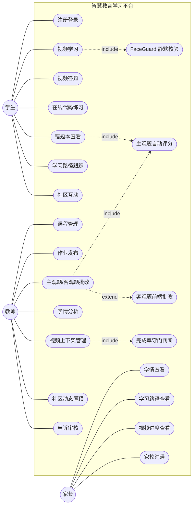


> 图片文件：[SVG](./images/图5-1_系统总体用例图.svg) · [JPEG](./images/图5-1_系统总体用例图.jpg)（PPT/Word 插入用）

**关键用例关系说明**：

- 学生"视频学习"用例 `<<include>>` "FaceGuard 静默核验"——学习过程中每 2 分钟触发一次人脸核验；
- 教师"作业批改"用例 `<<include>>` "主观题自动评分"——调用 Python AI 服务；
- 教师"作业批改"用例 `<<extend>>` "客观题前端批改"——客观题走 Rust-WASM 浏览器内批改；
- 学生"错题本查看"用例 `<<include>>` "错题协同过滤推送"——AI 服务后台计算潜在易错题；
- 教师"视频上下架管理"用例 `<<include>>` "完成率守门判断"——系统自动判断是否触发下架。

**图 5-2 FaceGuard 防刷课用例子图**

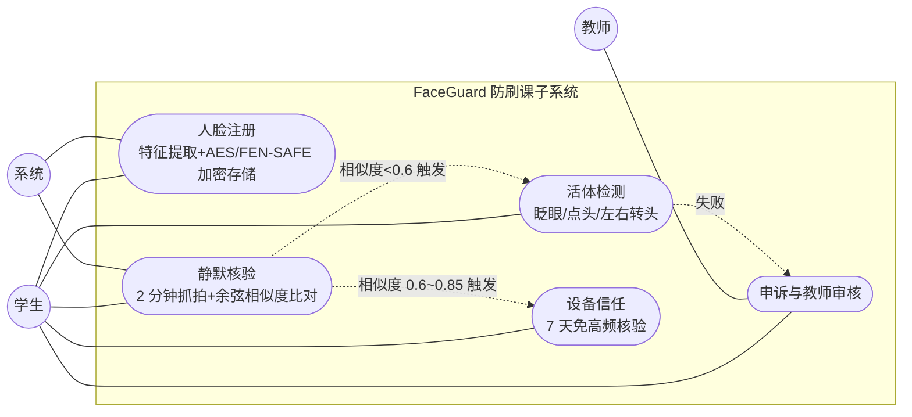


> 图片文件：[SVG](./images/图5-2_FaceGuard防刷课用例子图.svg) · [JPEG](./images/图5-2_FaceGuard防刷课用例子图.jpg)（PPT/Word 插入用）

#### 5.4.2 时序图

**图 5-3 学生视频学习 + FaceGuard 静默核验时序图**

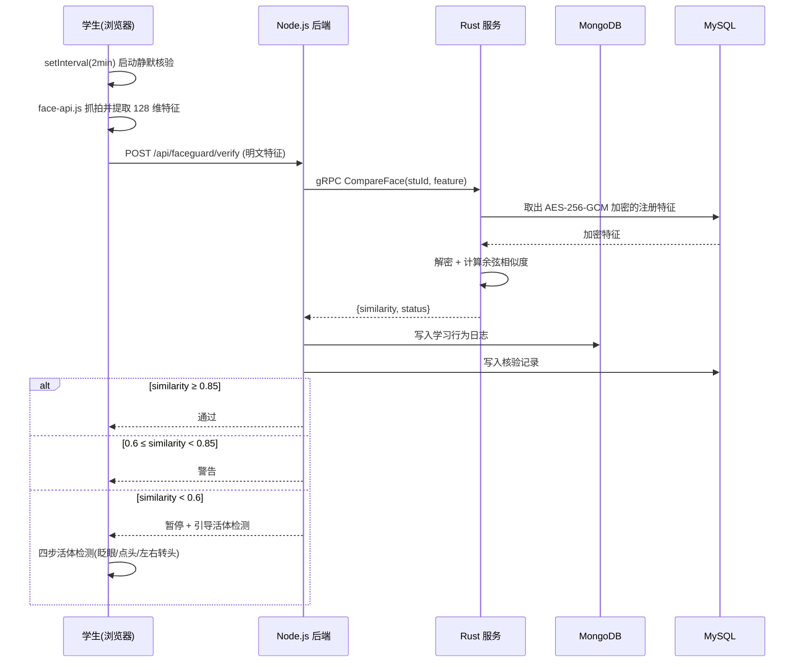

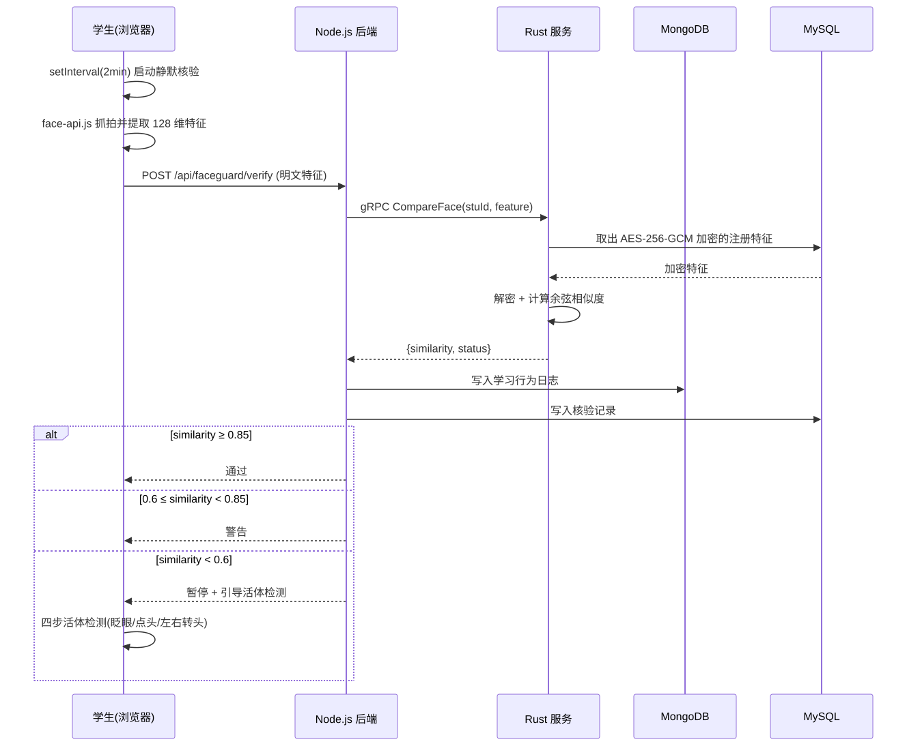

> 图片文件：[SVG](./images/图5-3_FaceGuard静默核验时序图.svg) · [JPEG](./images/图5-3_FaceGuard静默核验时序图.jpg)（PPT/Word 插入用）

**图 5-4 主观题自动评分时序图**

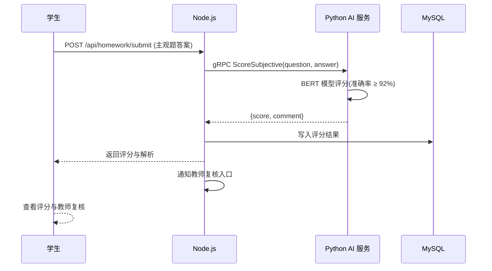

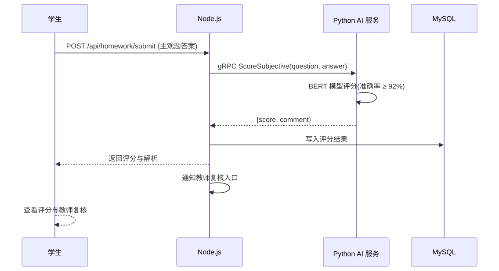

> 图片文件：[SVG](./images/图5-4_主观题自动评分时序图.svg) · [JPEG](./images/图5-4_主观题自动评分时序图.jpg)（PPT/Word 插入用）

**图 5-5 错题协同过滤推送时序图**

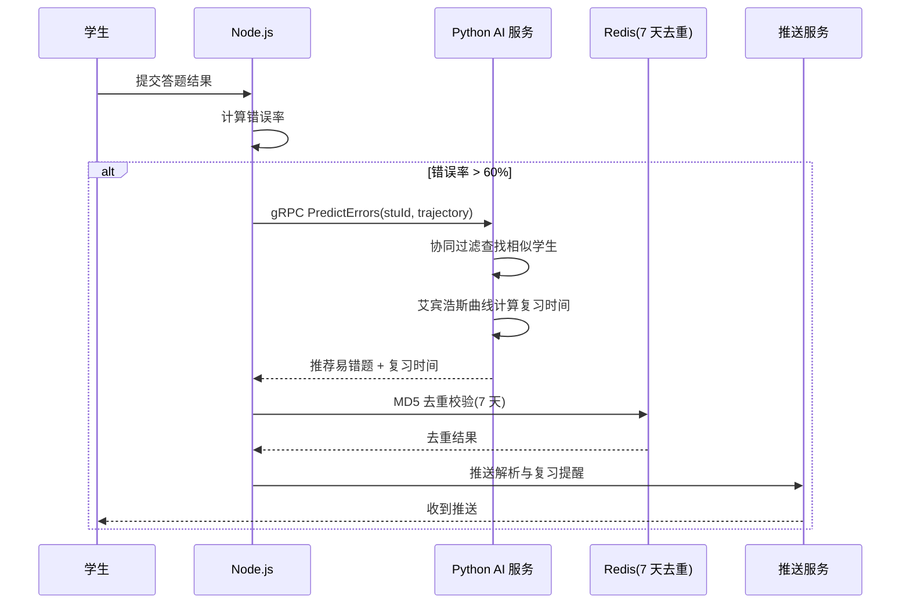

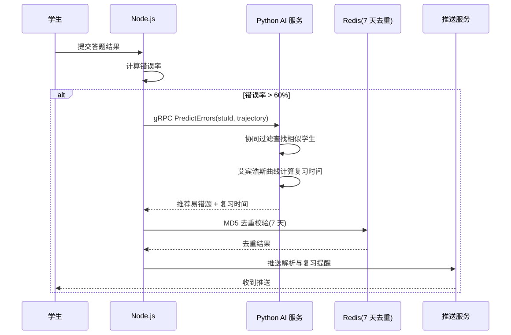

> 图片文件：[SVG](./images/图5-5_错题协同过滤推送时序图.svg) · [JPEG](./images/图5-5_错题协同过滤推送时序图.jpg)（PPT/Word 插入用）

**图 5-6 Rust 服务降级与 failover 时序图**

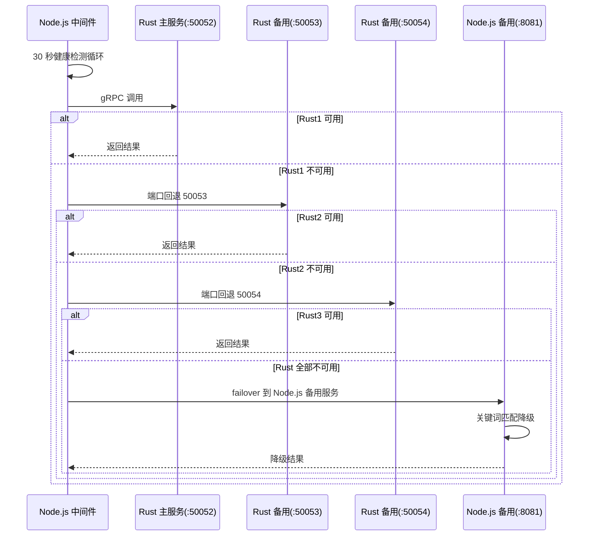

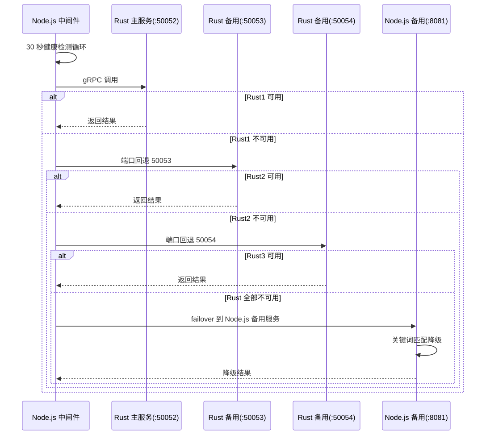

> 图片文件：[SVG](./images/图5-6_Rust服务降级failover时序图.svg) · [JPEG](./images/图5-6_Rust服务降级failover时序图.jpg)（PPT/Word 插入用）

#### 5.4.3 数据库 E-R 图

**图 5-7 数据库 E-R 图（核心表关系）**

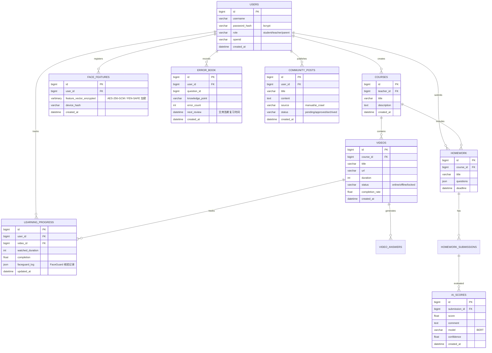


> 图片文件：[SVG](./images/图5-7_数据库ER图.svg) · [JPEG](./images/图5-7_数据库ER图.jpg)（PPT/Word 插入用）

**数据存储分工说明**：

| 存储 | 用途 | 示例 |
|------|------|------|
| MySQL 8.0 | 业务结构化数据 | 用户、课程、视频、作业、错题本、AI 评分、社区 |
| MongoDB 5.0 | 学习行为日志 | FaceGuard 核验流水、视频观看行为、代码运行日志 |
| Redis 6.0 | 缓存与去重 | 接口缓存、错题推送 7 天 MD5 去重、限流计数 |

### 5.5 实施步骤

1. 需求分析与系统设计（用例图、时序图、数据库 E-R 图）；
2. 数据库架构扩展（MySQL 表 + MongoDB 集合）；
3. 后端 API 开发（基础功能 → 高级功能）；
4. 前端界面开发（基础界面 → 高级功能）；
5. Python AI 服务与 Rust 高性能服务开发；
6. 多语言 gRPC 协同与降级机制实现；
7. V2.0 原创功能（FaceGuard / 代码编辑器 / 社区 / 错题推送 / 视频上下架）；
8. FEN-SAFE 轻量分组密码设计与权威测试（SAC 雪崩 / S 盒 / NIST SP800-22 / KAT / 性能对标）；
9. 系统集成与性能优化；
10. 测试与部署（多 Agent 健康监测 + GitHub Actions CI/CD）；
11. 撰写论文与答辩准备。

### 5.5 可行性分析

#### （1）技术可行性

- **前端**：Vue 3 + TypeScript + Vite 为业界成熟方案，团队已具备实际项目经验；
- **后端**：Node.js 18 + Express 在高并发场景表现稳定，gRPC 跨语言通信有官方多语言 stub 支持；
- **AI 服务**：Python + BERT 在 Hugging Face 有预训练模型可直接微调，face-api.js 提供浏览器端人脸特征提取能力；
- **高性能服务**：Rust 1.70 内存安全、生态完善（aes-gcm / Tonic / Actix-web），WASM 编译工具链成熟；
- **加密算法**：FEN-SAFE 已完成 SAC 雪崩、S 盒、NIST SP800-22 随机性、KAT、性能全套权威测试，11/11 项全 PASS，达到商用安全级；
- **数据库**：MySQL 8.0 + MongoDB 5.0 + Redis 6.0 均为生产级稳定组件，连接池与缓存策略已在前期原型中验证。

#### （2）经济可行性

- 全部采用开源技术栈，无授权费用；
- 纯 Windows 本地部署，零容器化，规避虚拟化与云服务成本；
- AI 服务可调用 DashScope（Qwen3）按量计费，且内置关键词匹配降级方案，成本可控；
- 测试环境仅需 4 核 CPU / 8GB 内存 / 50GB SSD，普通开发机即可满足。

#### （3）操作可行性

- 提供一键启动脚本（start-all-services.bat），一键启动 ≤ 10 秒；
- 完整文档体系：API 文档、部署指南、用户手册、架构文档、FEN-SAFE 测试报告；
- 多 Agent 健康监测体系自动完成 TS 编译 / Lint / 构建 / E2E 测试，并通过微信通知结果，降低运维门槛；
- 默认测试账号（学生/教师/家长）开箱即用，便于演示与验收。

#### （4）竞赛验证可行性

本项目已先后参加传智杯国赛与中国大学生计算机设计大赛，并在中国大学生计算机设计大赛省赛中荣获三等奖，关键技术路径与工程实现已得到赛事专家初步认可，技术方案具备落地可行性。

---

## 六、预期成果与创新点

### 6.1 预期成果

1. 一个完整可运行的 AI 驱动智慧教育学习平台（含学生/教师/家长三角色业务闭环），一键启动 ≤ 10 秒，核心业务流程演示 ≤ 5 分钟；
2. 完整的项目文档体系：API 文档、部署指南、用户手册、架构文档、毕业设计论文、开题报告；
3. 一套多 Agent 健康监测体系（TS 编译 / Lint / 构建 / E2E 测试 + 微信通知）+ GitHub Actions CI/CD 流水线；
4. FEN-SAFE v1.1 自研轻量分组密码及完整权威测试报告（SAC 雪崩 / S 盒 / NIST SP800-22 / KAT / 性能对标，11/11 全 PASS）；
5. 可量化的性能与安全指标：主观题评分准确率 ≥ 92%、客观题批改速度提升 8 倍、FaceGuard 抗造假能力提升 10 倍；
6. 毕业设计论文一份。

### 6.2 创新点

#### 6.2.1 算法与安全创新

1. **FaceGuard 静默核验**：每 2 分钟余弦相似度静默防刷课，全程无感知，抗造假能力较传统签到提升 10 倍；128 维特征向量 AES-256-GCM 加密存储，不保存原始照片，符合隐私规范；
2. **FEN-SAFE 自研轻量分组密码**：为平台人脸特征向量加密场景自研 128bit 分组 / 128bit 密钥轻量分组密码（LIGHT 5 轮 + SECURE 7 轮双版本），与 AES-128 在同等无硬件加速环境下对照测试：
   - SAC 雪崩达 64bit 理论最优（LIGHT 64.00bit / SECURE 64.04bit）；
   - S 盒非线性度 112（达 AES 同级）、DDT=4（与 AES/SM4 同为最优）；
   - NIST SP800-22 随机性 11/11 全 PASS；
   - LIGHT 2μs/分组，快于 AES-128 软件基准（2.7~3.2μs）；
   - 完整权威测试报告见 [加密算法_权威测试报告.md](./加密算法_权威测试报告.md)；
3. **错题协同过滤预测**：不只推给答错学生，还基于学习轨迹相似度预测"潜在易错"学生提前推送，结合艾宾浩斯遗忘曲线计算复习时间，7 天 MD5 去重防打扰；
4. **差分推送算法**：MD5 内容哈希去重，只推送新增异常，避免教师信息轰炸。

#### 6.2.2 架构与性能创新

5. **多语言 gRPC 协同**：Node.js + Python + Rust 跨语言通信，Node.js 负责高并发 API 网关、Python 负责人工智能计算、Rust 负责高性能加密与相似度计算；
6. **Rust-WASM 前端批改**：客观题批改在浏览器内执行，避免服务端往返，速度比纯 Python 快 8 倍；
7. **多级服务降级与容错**：Redis 不可用降级为内存缓存、Rust 服务不可用 30 秒健康检测自动 failover 到 Node.js 备用服务、AI 服务不可用降级到关键词匹配；
8. **多 Agent 健康监测体系**：本地一键完成 TS 编译 / Lint / 构建 / E2E 测试 + 微信通知，无需 CI/CD 服务器。

#### 6.2.3 业务与产品创新

9. **AI 代码编辑器**：在线运行 + AI 逐行解析 + 自动生成 Mermaid 流程图，零配置，MD5 结果缓存去重；
10. **视频智能上下架**：完成率守门（<30% 自动下架）+ 7 天保护期 + 教师锁定 + 难点视频阈值放宽至 25% + 审计日志；
11. **AI 教育社区**：AI 自动抓取并过滤教育/编程/竞赛热点，7 天自动归档，AI 内容审核 + 防刷屏限流 + 教师动态置顶；
12. **三角色业务闭环**：学生—教师—家长全角色覆盖，家长端实时查看学习路径、视频进度、错题本与薄弱点，实现家校协同。

---

## 七、进度安排

| 阶段 | 时间 | 工作内容 |
|------|------|---------|
| 1 | 第 1~2 周 | 查阅文献、需求分析、系统设计 |
| 2 | 第 3~5 周 | 数据库架构扩展、后端基础 API 开发 |
| 3 | 第 6~8 周 | 后端高级 API、前端基础界面开发 |
| 4 | 第 9~11 周 | Python AI 服务、Rust 高性能服务开发 |
| 5 | 第 12~13 周 | 多语言 gRPC 协同、V2.0 原创功能开发 |
| 6 | 第 14 周 | 系统集成、性能优化、测试与部署 |
| 7 | 第 15~16 周 | 撰写论文、准备答辩 |

---

## 八、参考文献

1. 教育部. 教育信息化 2.0 行动计划 [Z]. 2018.
2. 余胜泉. 人工智能教师的未来角色[J]. 开放教育研究, 2018.
3. Devlin J, Chang M W, Lee K, et al. BERT: Pre-training of Deep Bidirectional Transformers for Language Understanding[J]. arXiv, 2018.
4. 陈丽. 在线学习与面授学习的差异及其设计策略[J]. 中国电化教育, 2017.
5. 祝智庭, 郭绍青. 人工智能赋能教育:从工具性向到存在性向[J]. 中国电化教育, 2021.
6. You E M, et al. face-api.js: Neural Networks in JavaScript [EB/OL]. https://github.com/justadudewhohacks/face-api.js.
7. Ekman P, Friesen W V. Facial Action Coding System [M]. 1978.
8. Ebbinghaus H. Memory: A Contribution to Experimental Psychology [M]. 1885.
9. Vue.js 官方文档 [EB/OL]. https://vuejs.org/.
10. gRPC 官方文档 [EB/OL]. https://grpc.io/.
11. Webster A F, Tavares S E. On the Design of S-Boxes[C]//CRYPTO'85. Springer, 1986.（SAC 严格雪崩准则）
12. Biham E, Shamir A. Differential Cryptanalysis of the Full 16-round DES[C]//CRYPTO'91. Springer, 1992.
13. Matsui M. Linear Cryptanalysis Method for DES Cipher[C]//EUROCRYPT'93. Springer, 1994.
14. Nyberg K. Differentially Uniform Mappings for Cryptography[C]//EUROCRYPT'93. Springer, 1994.
15. NIST. SP800-22 Rev1a 统计随机性测试套件 [S]. 2010.
16. NIST. FIPS 197 高级加密标准 AES [S]. 2001.
17. 国家密码管理局. GM/T 0002-2012 SM4 分组密码算法 [S]. 2012.

---

> 指导教师：__________     学生：__________     日期：____ 年 __ 月 __ 日
